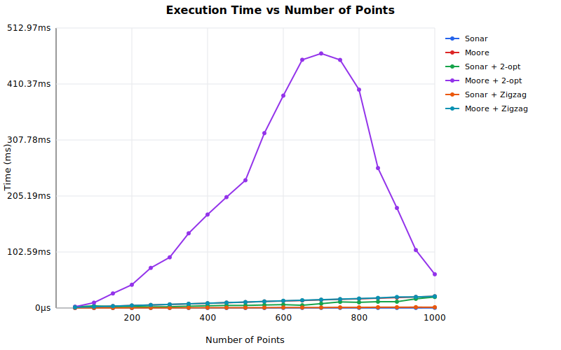
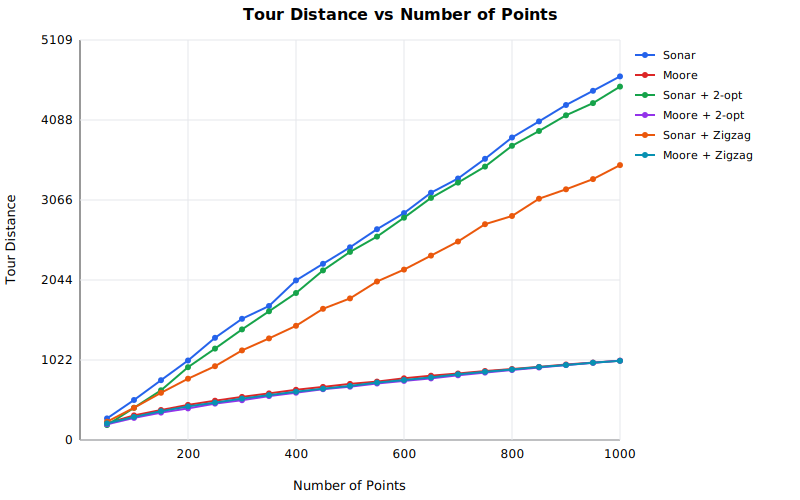

# TSP Solver Performance Benchmarks

This document contains detailed performance benchmarks for all TSP algorithm configurations.

## Methodology

- **Time Budget**: 60 seconds per algorithm configuration
- **Samples**: 10 random point configurations per test (averaged)
- **Grid Size**: 32x32 Moore grid (max 1024 points)
- **Scaling**: Max points estimated from 10-point calibration using O-notation, then verified
- **Growth Curve**: Measured at every 50-point interval up to max points

## Algorithm Overview

| Configuration      | Complexity | Description                                 |
| ------------------ | ---------- | ------------------------------------------- |
| **Sonar**          | O(n log n) | Radial sweep from centroid                  |
| **Moore**          | O(n log n) | Space-filling curve ordering                |
| **Sonar + 2-opt**  | O(n²)      | Sonar initial tour + 2-opt segment reversal |
| **Moore + 2-opt**  | O(n²)      | Moore initial tour + 2-opt segment reversal |
| **Sonar + Zigzag** | O(n²)      | Sonar initial tour + zigzag pair swap       |
| **Moore + Zigzag** | O(n²)      | Moore initial tour + zigzag pair swap       |

## Max Points in 60 Seconds

The algorithm that solves the greatest number of points within the time budget wins.

| Configuration      | Max Points | Avg Time | Avg Tour Distance |
| ------------------ | ---------: | -------: | ----------------: |
| **Sonar**          |       1020 |    446μs |           4688.16 |
| **Moore**          |       1020 |  21.93ms |           1021.89 |
| **Sonar + 2-opt**  |       1020 |  21.87ms |           4572.88 |
| **Moore + 2-opt**  |       1020 |  58.01ms |           1022.18 |
| **Sonar + Zigzag** |       1020 |   1.62ms |           3537.70 |
| **Moore + Zigzag** |       1020 |  21.92ms |           1022.13 |

## Execution Time Growth

Time measured at fixed intervals (every 50 points), averaged over 10 random configurations.



| Points | Sonar |   Moore | Sonar + 2-opt | Moore + 2-opt | Sonar + Zigzag | Moore + Zigzag |
| -----: | ----: | ------: | ------------: | ------------: | -------------: | -------------: |
|     50 |  25μs |  1.28ms |        2.04ms |        2.35ms |           65μs |         1.29ms |
|    100 |  35μs |  2.33ms |        3.99ms |        9.78ms |          102μs |         2.38ms |
|    150 |  46μs |  3.40ms |        2.59ms |       26.67ms |          137μs |         3.42ms |
|    200 |  61μs |  4.44ms |        2.88ms |       42.54ms |          208μs |         4.58ms |
|    250 |  81μs |  5.53ms |        2.04ms |       73.45ms |          263μs |         5.58ms |
|    300 |  91μs |  6.55ms |        2.29ms |       92.84ms |          320μs |         6.70ms |
|    350 | 109μs |  7.61ms |        3.33ms |      136.81ms |          443μs |         7.74ms |
|    400 | 125μs |  8.61ms |        4.10ms |      171.14ms |          471μs |         8.77ms |
|    450 | 157μs |  9.78ms |        4.68ms |      203.17ms |          508μs |         9.87ms |
|    500 | 157μs | 10.62ms |        4.70ms |      234.03ms |          573μs |        10.90ms |
|    550 | 178μs | 11.92ms |        5.57ms |      320.37ms |          673μs |        12.02ms |
|    600 | 196μs | 12.81ms |        6.15ms |      389.04ms |          931μs |        13.22ms |
|    650 | 206μs | 13.71ms |        5.04ms |      454.80ms |          860μs |        14.26ms |
|    700 | 240μs | 14.90ms |        7.98ms |      466.33ms |          908μs |        15.22ms |
|    750 | 249μs | 15.93ms |       11.18ms |      454.44ms |         1.13ms |        16.26ms |
|    800 | 251μs | 16.86ms |       10.41ms |      399.99ms |         1.17ms |        17.28ms |
|    850 | 271μs | 17.99ms |       11.56ms |      256.35ms |         1.45ms |        18.47ms |
|    900 | 301μs | 19.12ms |       11.48ms |      183.22ms |         1.43ms |        20.18ms |
|    950 | 302μs | 20.15ms |       16.80ms |      106.17ms |         1.54ms |        20.30ms |
|   1000 | 324μs | 21.38ms |       20.18ms |       61.80ms |         1.46ms |        21.43ms |

## Tour Quality

Tour distance (lower is better) at fixed intervals, averaged over 10 random configurations.



| Points |   Sonar |   Moore | Sonar + 2-opt | Moore + 2-opt | Sonar + Zigzag | Moore + Zigzag |
| -----: | ------: | ------: | ------------: | ------------: | -------------: | -------------: |
|     50 |  300.71 |  222.21 |        197.70 |        192.18 |         236.22 |         212.19 |
|    100 |  521.25 |  313.78 |        397.77 |        282.48 |         407.95 |         302.33 |
|    150 |  762.92 |  385.51 |        663.14 |        342.89 |         604.25 |         370.41 |
|    200 | 1015.58 |  444.22 |        905.85 |        406.96 |         775.55 |         429.98 |
|    250 | 1266.59 |  504.24 |       1222.57 |        460.32 |         950.21 |         484.07 |
|    300 | 1511.79 |  548.64 |       1415.00 |        514.07 |        1097.35 |         533.67 |
|    350 | 1762.87 |  599.27 |       1680.90 |        562.68 |        1320.76 |         575.64 |
|    400 | 1974.63 |  638.95 |       1867.92 |        599.26 |        1499.25 |         613.19 |
|    450 | 2238.15 |  678.48 |       2135.69 |        640.75 |        1647.93 |         661.25 |
|    500 | 2480.91 |  707.31 |       2364.25 |        682.49 |        1863.99 |         692.04 |
|    550 | 2689.45 |  750.05 |       2629.59 |        722.40 |        2008.96 |         734.37 |
|    600 | 2998.08 |  783.02 |       2873.77 |        755.90 |        2208.94 |         763.20 |
|    650 | 3197.66 |  818.99 |       3050.97 |        791.12 |        2398.44 |         800.55 |
|    700 | 3392.67 |  850.83 |       3277.84 |        827.48 |        2501.98 |         833.78 |
|    750 | 3651.55 |  881.38 |       3543.02 |        860.07 |        2723.71 |         868.99 |
|    800 | 3841.41 |  910.58 |       3741.62 |        894.55 |        2877.85 |         902.79 |
|    850 | 4048.59 |  935.63 |       3969.23 |        930.10 |        3046.74 |         928.89 |
|    900 | 4258.73 |  963.31 |       4140.16 |        958.85 |        3206.53 |         961.10 |
|    950 | 4493.48 |  988.69 |       4344.12 |        987.32 |        3348.77 |         987.31 |
|   1000 | 4632.53 | 1012.68 |       4555.38 |       1012.79 |        3497.88 |        1012.41 |

## Running Benchmarks

```bash
bun run benchmarks/run.js
```

## Notes

- All times are averages of 10 runs with different random point sets
- Tour distances are calculated as closed loops (returning to start)
- Random point generation ensures unique positions on the grid
- Results may vary based on hardware
