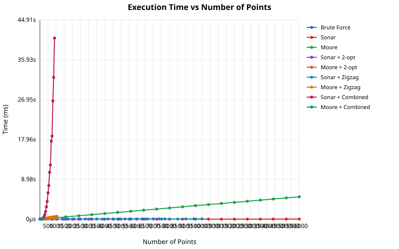
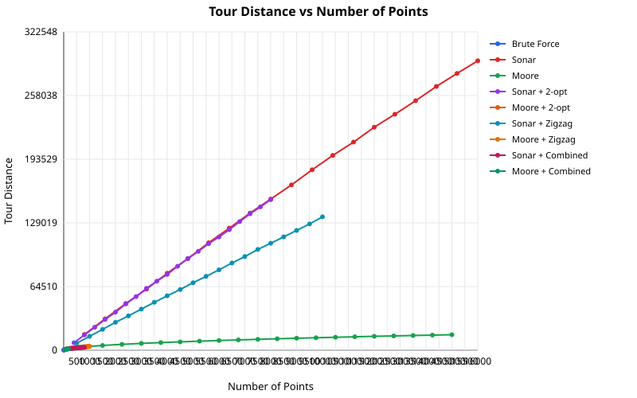

# TSP Visual Solver

An interactive visualization tool for the Traveling Salesman Problem (TSP) that demonstrates and compares two space-filling curve-based heuristic algorithms.


## Live Demo

Visit [https://konard.github.io/tsp](https://konard.github.io/tsp) to try the solver.

## Features

- **Interactive Visualization**: Watch algorithms solve TSP step-by-step with animated demonstrations
- **Two Algorithm Comparison**: Side-by-side comparison of Sonar Visit and Moore Curve algorithms
- **Grid-Aligned Points**: All points are placed on grid intersections for clean visualization
- **Progress Tracking**: Real-time progress display (angle for Sonar, percentage for Moore Curve)
- **Optimization Phase**: Optional 2-opt optimization to improve initial solutions
- **Responsive Design**: Works on desktop, tablet, and mobile devices
- **Adjustable Parameters**: Customize grid size, number of points, and animation speed

## Project Structure

```
./src
  algorithms/
    progressive/               # Step-by-step algorithms (for visualization)
      solution/
        sonar.js              # Sonar (Radial Sweep) algorithm
        moore.js              # Moore Curve algorithm
        index.js              # Solution barrel export
      optimization/
        two-opt.js            # Generic 2-opt segment reversal
        zigzag-opt.js         # Generic zigzag adjacent swap
        index.js              # Optimization barrel export
      index.js                # Progressive module export
    atomic/                   # All-at-once algorithms (direct computation)
      solution/
        sonar.js              # Atomic Sonar solution
        moore.js              # Atomic Moore solution
        index.js
      optimization/
        two-opt.js            # Atomic 2-opt optimization
        zigzag-opt.js         # Atomic zigzag optimization
        index.js
      index.js                # Atomic module export
    verification/             # Optimal tour verification
      brute-force.js          # Brute-force exact solver
      index.js                # Verification barrel export
    utils.js                  # Shared utility functions
    index.js                  # Main algorithms barrel export
  ui/
    components/
      TSPVisualization.jsx    # SVG-based visualization component
      Controls.jsx            # Control panel component
      Legend.jsx              # Color legend components
      VisualizationPanel.jsx  # Complete visualization panel
      index.js                # Components barrel export
    App.jsx                   # Main application component
    styles.css                # All CSS styles
    index.js                  # UI module export
index.html                    # Main HTML entry point
README.md                     # This file
```

## Algorithms

### Sonar Visit Algorithm

Also known as: Radial Sweep, Angular Sort, Polar Angle Sort, Centroid-based Ordering

This algorithm works by:

1. Computing the centroid (center of mass) of all points
2. Calculating the polar angle of each point relative to the centroid
3. Sorting points by their polar angle
4. Connecting points in angular order to form a tour

The visualization shows a "sweep line" rotating around the centroid, visiting points as it passes them.

### Moore Curve Algorithm

Also known as: Space-Filling Curve, Hilbert Curve Variant, Fractal Ordering

This algorithm uses a Moore curve (a variant of the Hilbert curve) to order points:

1. Generate a Moore curve that fills the grid space
2. Map each point to its nearest position on the curve
3. Sort points by their position along the curve
4. Connect points in curve-order to form a tour

The Moore curve is a space-filling curve that visits every cell in a grid exactly once while maintaining spatial locality, making it effective for TSP approximations.

### Optimization

Both algorithms support optional optimization phases. Three optimization methods are available:

#### 2-opt (Segment Reversal)

- Picks two non-adjacent edges, removes them, and reconnects by reversing the segment between them
- Searches all pairs of edges (O(n^2) per pass)
- Effective at removing crossing edges and untangling large detours

#### ZigZag (Adjacent Pair Swap)

- Examines four consecutive points and swaps the middle two if it reduces distance
- Scans the tour linearly (O(n) per pass), making it faster per iteration than 2-opt
- Effective at fine-tuning local ordering, especially in space-filling curve tours

#### Combined (ZigZag + 2-opt)

- Alternates between ZigZag and 2-opt until neither finds improvements
- Produces the best tour quality at the cost of longer computation time

For a detailed comparison of ZigZag vs 2-opt, see the [case study](docs/case-studies/issue-53/README.md).

## Usage

### Web Application

1. **Set Parameters**:
   - Grid Size (N): Size of the N×N grid (5-50)
   - Points (M): Number of random points to generate
   - Animation Speed: Control visualization pace

2. **Generate Points**: Click "New Points" to create random grid-aligned points

3. **Run Algorithms**: Click "Start" to watch both algorithms solve the TSP simultaneously

4. **Optimize**: After initial solutions complete, click "Optimize" to run 2-opt improvements

### JavaScript Library

The algorithms can be used as a standalone JavaScript library:

```javascript
// Progressive (step-by-step) - for visualization
import {
  sonarAlgorithmSteps,
  mooreAlgorithmSteps,
  sonarOptimizationSteps,
  mooreOptimizationSteps,
  calculateMooreGridSize,
  generateRandomPoints,
  calculateTotalDistance,
} from './src/algorithms/index.js';

// Generate points
const gridSize = 10;
const mooreGridSize = calculateMooreGridSize(gridSize);
const points = generateRandomPoints(mooreGridSize, 15);

// Get step-by-step solution (for animation)
const sonarSteps = sonarAlgorithmSteps(points);
const mooreSteps = mooreAlgorithmSteps(points, mooreGridSize);

// Optimize the tour
const sonarTour = sonarSteps[sonarSteps.length - 1].tour;
const optimizationSteps = sonarOptimizationSteps(points, sonarTour);

// Calculate total distance
const finalTour = optimizationSteps[optimizationSteps.length - 1].tour;
const distance = calculateTotalDistance(finalTour, points);
```

```javascript
// Atomic (all-at-once) - for direct computation
import { sonarSolution, mooreSolution } from './src/algorithms/atomic/index.js';
import {
  sonarOptimization,
  mooreOptimization,
} from './src/algorithms/atomic/index.js';

const { tour: sonarTour, centroid } = sonarSolution(points);
const { tour: mooreTour, curvePoints } = mooreSolution(points, mooreGridSize);

const { tour: optimizedTour, improvement } = sonarOptimization(
  points,
  sonarTour
);
```

## Technical Details

- Built with React 18 (loaded from CDN for the web app)
- Uses SVG for high-quality, scalable rendering
- Modular architecture with clear separation of algorithms and UI
- Single-file HTML application (no build step required for basic usage)
- Babel for JSX transpilation in-browser

## Development

To modify the solver, you can:

1. **Edit algorithms**: Modify files in `src/algorithms/` for algorithm changes
2. **Edit UI**: Modify files in `src/ui/` for interface changes
3. **Quick prototyping**: Edit `index.html` directly for rapid iteration

### Running Locally

Simply open `index.html` in a browser. The application loads all dependencies from CDN.

### For ES Module Usage

The `src/` directory contains ES modules that can be imported directly in modern JavaScript environments:

```bash
# With Node.js
node --experimental-vm-modules your-script.js

# With Deno
deno run your-script.ts

# With modern bundlers (Vite, esbuild, etc.)
# Just import directly
```

## Algorithm Complexity

| Algorithm             | Time Complexity | Space Complexity |
| --------------------- | --------------- | ---------------- |
| Sonar Visit           | O(n log n)      | O(n)             |
| Moore Curve           | O(n log n)      | O(n)             |
| 2-opt Optimization    | O(n²)           | O(n)             |
| ZigZag Optimization   | O(n²)           | O(n)             |
| Combined Optimization | O(n³)           | O(n)             |

Where n is the number of points.

## Performance Benchmarks

Performance tested with Bun runtime on a 128x128 Moore grid (60s time budget, 10 random samples averaged):

### Max Points in 60 Seconds

| Configuration        | Max Points | Avg Time | Avg Tour Distance |
| -------------------- | ---------: | -------: | ----------------: |
| **Sonar**            |      16380 |   7.25ms |         296599.20 |
| **Moore**            |      15650 |    5.01s |          16034.14 |
| **Sonar + Zigzag**   |      10030 |  27.93ms |         135348.73 |
| **Sonar + 2-opt**    |       8060 |  79.96ms |         153571.61 |
| **Moore + Zigzag**   |       1040 | 331.61ms |           3862.26 |
| **Moore + 2-opt**    |       1020 | 575.33ms |           3939.16 |
| **Sonar + Combined** |        810 |   28.08s |           2920.41 |
| **Moore + Combined** |        220 | 133.63ms |           1612.12 |
| **Brute Force**      |         10 |  70.15ms |            359.93 |

### Execution Time Growth



### Tour Quality



**Key findings:**

- **Sonar** solves the most points (16380) within 60 seconds
- **Sonar** is faster but produces longer tours
- **Moore** produces significantly better tours, especially for larger problems
- **ZigZag** outperforms **2-opt** on space-filling curve tours due to its linear-time passes and adjacent-swap strategy that matches the local misordering pattern of these algorithms ([details](docs/case-studies/issue-53/README.md))
- **Combined** (alternating ZigZag + 2-opt) produces the best tour quality

For detailed benchmark analysis, see [BENCHMARK.md](BENCHMARK.md).

## License

[Unlicense](LICENSE) - Public Domain
