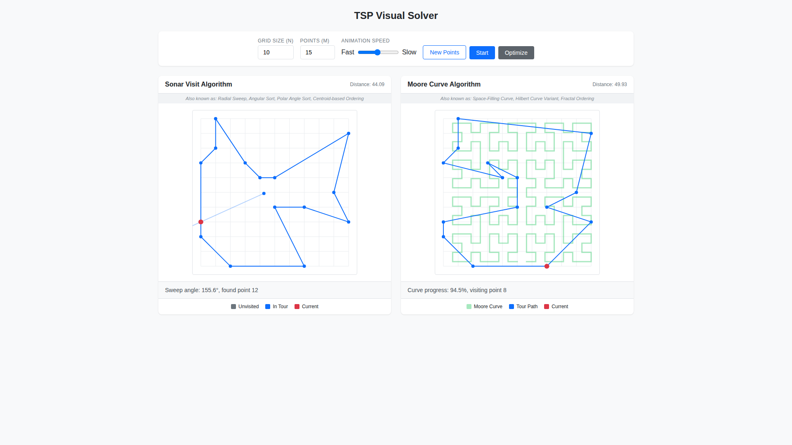
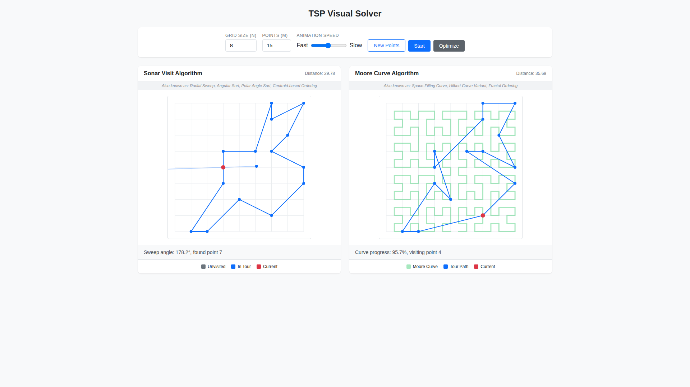

# Case Study: Issue #5 - Moore Curve Visualization Enhancement

## Issue Summary

**Issue Title:** Moore curve is not highlighted

**Issue Description:** The Moore curve in the TSP Visual Solver was not properly highlighted and had visual issues:

1. Moore curve was not highlighted as semitransparent green
2. Curve edges were not aligned with the square grid
3. Original rendering used low-resolution Canvas instead of SVG

## Timeline

1. **Issue Reported:** User noticed that the Moore curve visualization was difficult to follow visually
2. **Root Cause Identified:** The curve was rendered in a very light gray color (`#dee2e6`) with thin lines (1px)
3. **Solution Implemented:**
   - Changed curve color to semitransparent green (`rgba(34, 197, 94, 0.4)`)
   - Increased line width from 1px to 3px
   - Converted from Canvas to SVG rendering
   - Added proper grid alignment for the Moore curve edges

## Technical Analysis

### Original Implementation Issues

The original Canvas-based rendering had several problems:

```javascript
// Original code - hard to see
ctx.strokeStyle = '#dee2e6'; // Very light gray
ctx.lineWidth = 1; // Thin line
```

### Solution Applied

#### 1. Color Change to Semitransparent Green

Changed the Moore curve rendering to use a semitransparent green color that makes the curve visually prominent:

```javascript
// SVG path with semitransparent green
<path
  d={pathData}
  fill="none"
  stroke="rgba(34, 197, 94, 0.4)" // Semitransparent green
  strokeWidth="3" // Bolder line
  strokeLinecap="square"
  strokeLinejoin="miter"
/>
```

#### 2. SVG Rendering

Replaced the Canvas-based `TSPCanvas` component with an SVG-based `TSPVisualization` component. Benefits:

- Sharper rendering at any zoom level
- Better accessibility
- Easier DOM manipulation and styling
- No pixelation on high-DPI displays

#### 3. Grid Alignment

Modified the Moore curve point generation to align with grid intersections:

```javascript
const mooreCurveToPoints = (sequence, gridSize) => {
  // Step size ensures vertices land on grid intersections
  const stepSize = gridSize / curveGridSize;

  // Start at grid boundary
  let x = Math.round(gridSize / 2);
  let y = gridSize; // Start at bottom edge (grid intersection)

  // ...
};
```

## Visual Comparison

### Before Fix


- Moore curve barely visible (light gray)
- Thin lines hard to follow
- Canvas rendering with potential pixelation

### After Fix



- Moore curve highlighted in semitransparent green
- Bolder 3px lines easy to follow visually
- SVG rendering for crisp display at any size

### Grid Alignment (8x8 Grid)



- When grid size is a power of 2, Moore curve aligns perfectly with grid lines

## Implementation Files Changed

1. **index.html** - Main application file
   - Added `TSPVisualization` SVG-based component (replaces Canvas)
   - Updated `mooreCurveToPoints` function for better grid alignment
   - Updated legend color to match new green curve color

## Testing

- Visual testing performed using Playwright MCP
- All existing unit tests pass
- ESLint checks pass with no errors

## Lessons Learned

1. **Space-filling curves and grid alignment**: Moore curves naturally align with power-of-2 grids. For non-power-of-2 grid sizes, the curve creates its own internal grid that may not perfectly align with the visual grid.

2. **SVG vs Canvas for visualizations**: SVG provides better quality for this type of geometric visualization, especially when zooming or on high-DPI displays.

3. **Visual accessibility**: Semi-transparent colors with sufficient contrast help users follow the curve pattern without obscuring underlying data points.

## References

- [Moore Curve on Wikipedia](https://en.wikipedia.org/wiki/Moore_curve)
- [Hilbert Curve and Space-Filling Curves](https://en.wikipedia.org/wiki/Hilbert_curve)
- [SVG vs Canvas Performance](https://developer.mozilla.org/en-US/docs/Web/API/Canvas_API/Tutorial/Optimizing_canvas)
