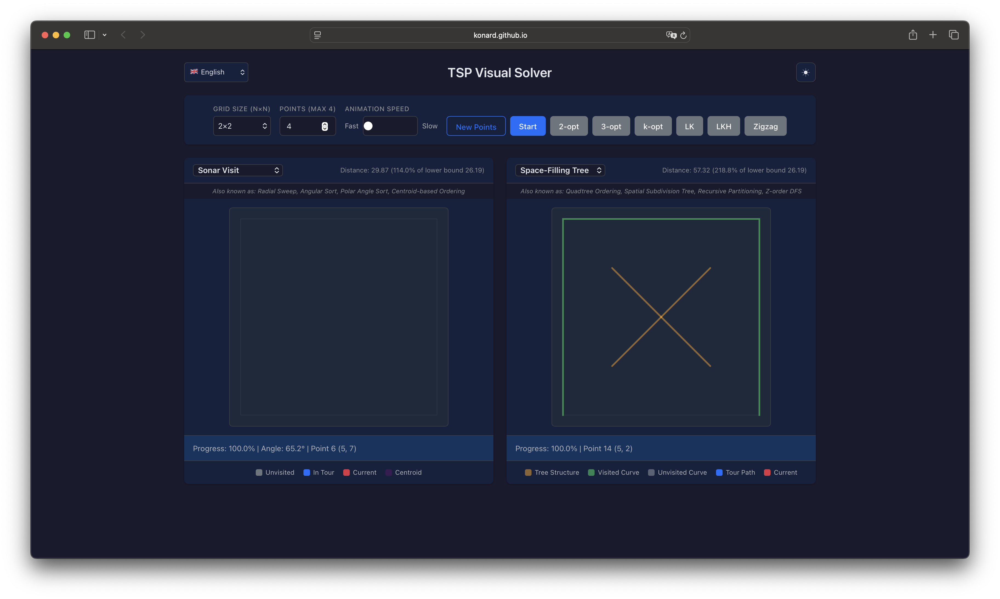
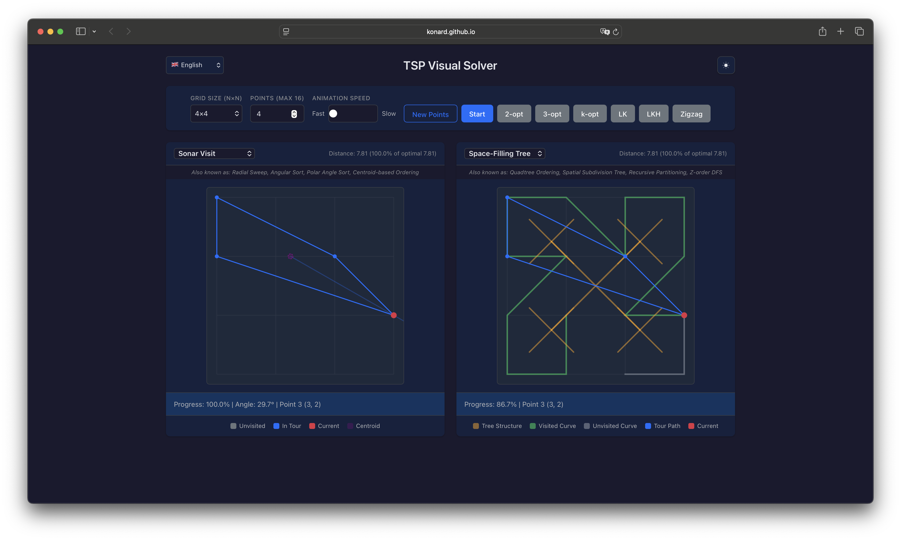
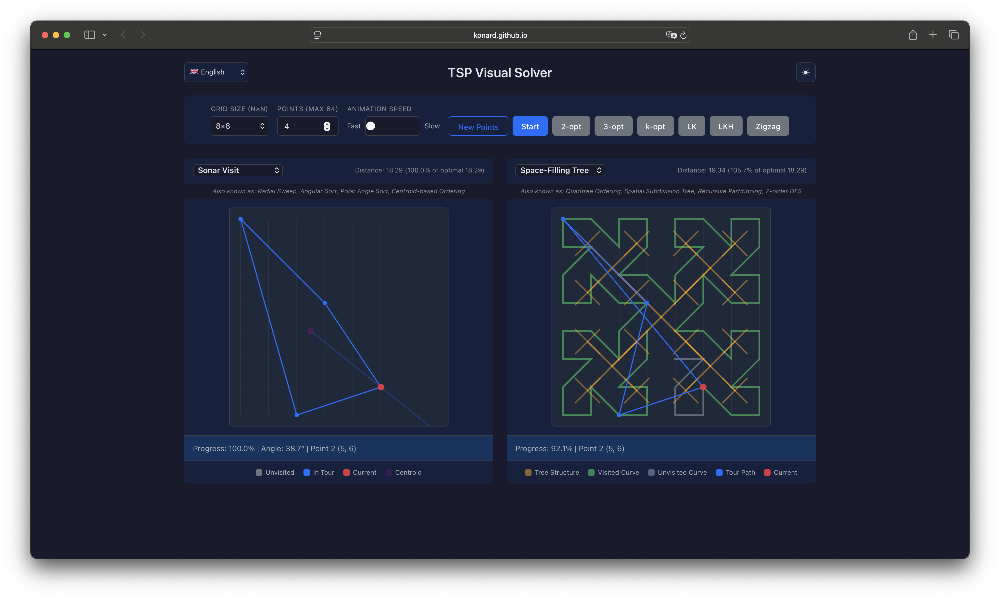

# Case Study: Issue #74 — Tree Structure Pattern Not Aligned with Grid Points

## Summary

**Issue**: [GitHub Issue #74](https://github.com/konard/tsp/issues/74)
**Date**: 2026-03-14
**Component**: `generateTreeEdges()` in `src/lib/algorithms/atomic/solution/space-filling-tree.js`
**Root Cause**: The recursive subdivision function used `(treeGridSize - 1) / 2` as both the center coordinate and the half-extent for spatial subdivision. Since grid sizes are always powers of 2 (even numbers), this produced half-integer extents that never subdivide to integer coordinates.

## Timeline of Events

| Step | Event                                                                                                                                                 |
| ---- | ----------------------------------------------------------------------------------------------------------------------------------------------------- |
| 1    | **2026-02-15**: PR #71 merged — implemented space-filling tree algorithm for TSP with `generateTreeEdges()` function for tree structure visualization |
| 2    | **2026-03-14**: Issue #74 reported — tree structure pattern is not aligned with actual grid points at any grid size                                   |
| 3    | Screenshots provided showing misalignment at 2x2 (zero grid points touched), 4x4 (only center area), and 8x8 grids                                    |
| 4    | Additional requests: clickable legend toggle for tree visibility, reduced tree opacity for better blending                                            |
| 5    | Root cause identified: mathematical error in half-extent calculation for recursive quadrant subdivision                                               |
| 6    | Fix applied: separate center coordinate from half-extent, using `treeGridSize / 2` for half-extent                                                    |

## Issue Screenshots

### 2x2 Grid — Zero Points Aligned

The tree structure touches no grid intersection points. All tree nodes land at fractional coordinates.



### 4x4 Grid — Only Center Area Aligned

Only 4 points near the center of the grid are close to grid intersections.



### 8x8 Grid — Same Pattern

The misalignment pattern persists at larger grid sizes.



## Root Cause Analysis

### The Bug

In `src/lib/algorithms/atomic/solution/space-filling-tree.js`, the `generateTreeEdges()` function computes tree node positions using:

```javascript
const halfGrid = (treeGridSize - 1) / 2;
recurse(halfGrid, halfGrid, halfGrid, halfGrid, 0);
```

This uses `(treeGridSize - 1) / 2` as **both** the center coordinate **and** the half-extent for subdivision. The grid has integer coordinates in `[0, treeGridSize - 1]`, so the center of this range is indeed `(treeGridSize - 1) / 2`. However, when this same value is used as the half-extent for recursive subdivision, the subdivision **never reaches integer coordinates** at any depth.

### Mathematical Proof

For `treeGridSize = 2` (order 1):

- `halfGrid = (2-1)/2 = 0.5`
- Root at `(0.5, 0.5)`, quadrant centers at `(0.25, 0.25)`, `(0.75, 0.25)`, `(0.25, 0.75)`, `(0.75, 0.75)`
- **Zero** of 5 unique points are at integer grid coordinates.

For `treeGridSize = 4` (order 2):

- `halfGrid = (4-1)/2 = 1.5`
- Root at `(1.5, 1.5)`, level-0 quadrant centers at `(0.75, 0.75)`, `(2.25, 0.75)`, etc.
- Level-1 leaf nodes: `(0.375, 0.375)`, `(1.125, 0.375)`, ... — all non-integers
- **Zero** of 21 unique points are at integer coordinates.

The issue: `(treeGridSize - 1) / 2` is only an integer when `treeGridSize` is odd, but valid grid sizes are always powers of 2 (even numbers), making the center always a half-integer. Dividing a half-integer extent by 2 repeatedly produces quarter-integers, eighth-integers, etc. — never integers.

### Why This Pattern Occurs in Quadtree Subdivision

This is a common pitfall in recursive spatial subdivision algorithms. The distinction between:

1. **Center of coordinate range** `[0, N-1]`: midpoint is `(N-1)/2` — correct for positioning
2. **Half-extent of grid span**: should be `N/2` — correct for subdivision distances

When `N` is even (as with power-of-2 grid sizes), these two values differ by `0.5`. Using the center value as the half-extent introduces a systematic offset that compounds through each level of recursion.

This type of off-by-half error is analogous to fencepost errors in discrete mathematics, where the distinction between "number of items" vs "number of gaps" matters. Here, it's the distinction between "range midpoint" vs "range half-width."

### The Fix

Use `treeGridSize / 2` as the half-extent instead of `(treeGridSize - 1) / 2`:

```javascript
const center = (treeGridSize - 1) / 2; // correct center of [0, gridSize-1]
const halfGrid = treeGridSize / 2; // half-extent covers full grid width
recurse(center, center, halfGrid, halfGrid, 0);
```

With this fix:

- **Leaf-level nodes** (depth = order) land exactly on integer grid coordinates.
- **Intermediate nodes** remain at half-integer positions, which is geometrically correct — they represent centers of spatial cells, not grid intersections.
- For `treeGridSize = 2`: all 4 leaf points are on grid `(0,0)`, `(1,0)`, `(0,1)`, `(1,1)`.
- For `treeGridSize = 4`: all 16 leaf points are on grid (every integer coordinate pair).
- For `treeGridSize = 8`: all 64 leaf points are on grid.

### Verification for 4x4 Grid (order 2)

After fix:

- Center: `(4-1)/2 = 1.5`
- Half-extent: `4/2 = 2.0`
- Root at `(1.5, 1.5)`
- Level 0 quadrant centers: `(0.5, 0.5)`, `(2.5, 0.5)`, `(0.5, 2.5)`, `(2.5, 2.5)` — half-integers (expected for intermediate nodes)
- Level 1 leaf nodes from `(0.5, 0.5)`: `(0, 0)`, `(1, 0)`, `(0, 1)`, `(1, 1)` — **all integers**

## Additional Issues Addressed

### 1. Legend not clickable (show/hide tree structure)

The legend items were display-only `<div>` elements with no interactivity. Added `onClick` handlers and cursor styling to allow toggling visibility of the tree structure overlay. Implementation:

- Added `showTreeEdges` state to `App.jsx`
- Added `onToggleTreeEdges` callback passed through to `Legend.jsx`
- `LegendItem` component now supports `onClick` and `active` props with visual feedback (cursor pointer, opacity toggle)

### 2. Tree structure too opaque

The tree edges used `rgba(255, 165, 0, 0.5)` (50% opacity), making them visually dominant over the grid. Reduced to `rgba(255, 165, 0, 0.25)` (25% opacity) for better blending with the background, matching the user's request for "more transparency relative to surroundings."

## Files Modified

| File                                                       | Change                                                                             |
| ---------------------------------------------------------- | ---------------------------------------------------------------------------------- |
| `src/lib/algorithms/atomic/solution/space-filling-tree.js` | Fixed half-extent calculation in `generateTreeEdges()` (PR #75)                    |
| `src/app/ui/App.jsx`                                       | Added `showTreeEdges` state and toggle callback (PR #75)                           |
| `src/app/ui/components/TSPVisualization.jsx`               | Conditional tree rendering based on `showTreeEdges` prop, reduced opacity (PR #75) |
| `src/app/ui/components/Legend.jsx`                         | Made Tree Structure legend item clickable with toggle behavior (PR #75)            |
| `scripts/merge-changesets.mjs`                             | Fixed `PACKAGE_NAME` from `'my-package'` to `'tsp-algorithms'` (PR #76)            |
| `scripts/create-manual-changeset.mjs`                      | Fixed `PACKAGE_NAME` from `'my-package'` to `'tsp-algorithms'` (PR #76)            |
| `scripts/format-release-notes.mjs`                         | Fixed `PACKAGE_NAME` from `'my-package'` to `'tsp-algorithms'` (PR #76)            |
| `bun.lock`                                                 | Regenerated with correct package name `tsp-algorithms` (PR #76)                    |

## CI/CD Release Pipeline Failure

### Problem

After PR #75 merged the tree alignment fix to `main`, the CI/CD pipeline's **Release** job failed. The GitHub Pages deploy succeeded (the `deploy` job is independent), but the npm release and version bump were blocked. The owner noted in [issue comment](https://github.com/konard/tsp/issues/74#issuecomment-4060676050) that "release and publish was skipped."

### Root Cause

The `scripts/merge-changesets.mjs` script contained a placeholder package name `'my-package'` instead of the actual package name `'tsp-algorithms'`:

```javascript
// Line 29 of scripts/merge-changesets.mjs (before fix)
const PACKAGE_NAME = 'my-package';
```

This caused the script's regex to look for `'my-package': patch` in changeset files, but all 26 changeset files correctly used `'tsp-algorithms': patch`. Every changeset failed parsing, producing the error:

```
Error: No valid changesets could be parsed
```

### Timeline

| Step | Event                                                                                                                         |
| ---- | ----------------------------------------------------------------------------------------------------------------------------- |
| 1    | PR #75 merged to main at 2026-03-14T14:51:46Z (commit `300b770`)                                                              |
| 2    | CI run `23089610370` triggered on the previous main commit (`fefed3d`, PR #73 merge)                                          |
| 3    | Deploy to GitHub Pages: **SUCCESS** — the tree alignment fix is live                                                          |
| 4    | Release job: **FAILURE** at step "Merge multiple changesets" — all 26 changesets failed to parse due to package name mismatch |
| 5    | Update Benchmarks: **still running** (60-minute timeout benchmark suite)                                                      |
| 6    | CI run `23090230153` for PR #75 merge commit (`300b770`): **PENDING** — blocked by concurrency group with still-running run   |

### Affected Scripts

Three scripts had the same `'my-package'` placeholder that was never updated to `'tsp-algorithms'`:

| Script                                | Purpose                                | Impact                                            |
| ------------------------------------- | -------------------------------------- | ------------------------------------------------- |
| `scripts/merge-changesets.mjs`        | Merge multiple changesets pre-release  | **Release blocked** — cannot parse any changesets |
| `scripts/create-manual-changeset.mjs` | Create changesets for manual releases  | Would create changesets with wrong package name   |
| `scripts/format-release-notes.mjs`    | Format GitHub release notes with badge | npm badge link would point to wrong package       |

Additionally, `bun.lock` contained `"name": "my-package"` from when the project was first initialized under that name. While cosmetic (bun resolves by path, not name), it was corrected by regenerating the lockfile.

### Fix

Updated `PACKAGE_NAME` from `'my-package'` to `'tsp-algorithms'` in all three scripts. Regenerated `bun.lock` to reflect the correct package name.

### Historical Context

This is a recurring issue in this project. Previous case study [Issue #46](../issue-46/README.md) documented the same class of bug in `publish-to-npm.mjs`, which was fixed. However, the fix was not applied consistently across all scripts. The `rename-and-restructure.md` changeset claims to "Fix changeset package name from `my-package` to `tsp-algorithms`" but only partially addressed the problem.

## Verification

- Experiment script: `experiments/tree-alignment-test.js`
- Verified that all leaf-level tree nodes align with integer grid coordinates for grid sizes 2, 4, 8, 16, 32, 64, 128.
- All 545 existing tests pass.
- ESLint, Prettier, and build checks pass.
